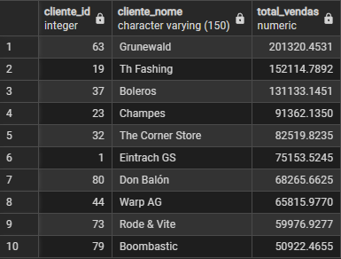
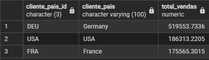
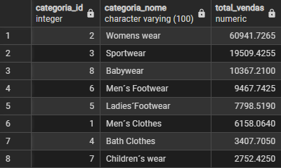
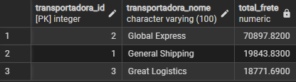
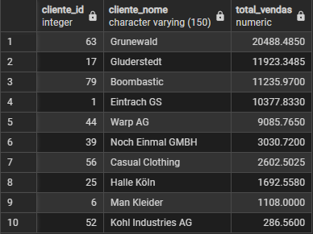
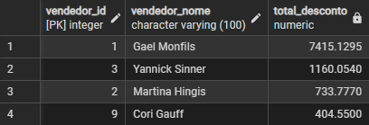
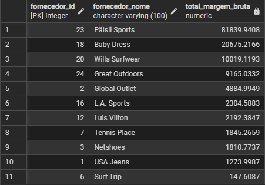
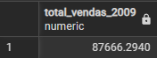
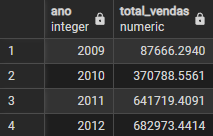
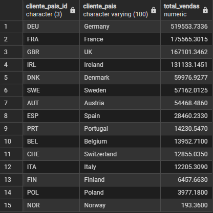

# Inteligência Empresarial | Transformando dados - Etapa 1

## 📈 Estratégias e tecnologias utilizadas

1. As tabelas foram montadas em um SGBD (no PostgreSQL), e, em seguida, montamos as consultas para responder às questões propostas. 

2. A partir dos resultados destas consultas, a ideia inicial era montar os gráficos utilizando o Excel, mas acabamos optando pelo Pandas, visto que é uma tecnologia mais acessível e fácil de ser utilizada, além de ser uma ferramenta muito utilizada no mercado.

3. Por último, levando em consideração que nosso consumidor final seria uma pessoa de outra área que não tem conhecimento técnico, optamos por apresentar os resultados através de uma aplicação web, bem simples, apenas para exibir os dados de forma mais amigável e acessível.

## ⌛ Tempo gasto para produzir os resultados

1. Construção das tabelas e consultas: aproximadamente 2h e 15 minutos

2. Criação dos gráficos e análise dos dados: aproximadamente 1h e 38 minutos

3. Desenvolvimento da aplicação web: aproximadamente 2h e 30 minutos

4. Tempo total gasto: 6h e 23 minutos

## 📊 Análise dos dados

1. Quem são os 10 maiores clientes em termos de vendas ($)?

2. Quais os três maiores países em termos de vendas ($)?

3. Quais as categorias de produtos que geram maior faturamento (vendas $) no Brasil?

4. Qual a despesa com frete envolvendo cada transportadora?

5. Quais são os principais clientes (vendas $) do segmento "Calçados Masculinos" (Men´s Footwear) na Alemanha?

6. Quais os vendedores que mais dão descontos nos Estados Unidos?

7. Quais os fornecedores que dão a maior margem de lucro ($) no segmento "Vestuário Feminino" (Womens wear)?

8. Quanto foi vendido ($) em 2009?

- Total vendido em 2009:

- Evolução anual 2009–2012

9. Quais são os principais clientes (vendas $) do segmento "Calçados Masculinos" (Men´s Footwear) no ano de 2013? Para quais cidades houve venda e quanto?

    `Não há registros em 2013.`

10. Na Europa, quanto se vende ($) para cada país?

## 🌎 Links

1. Repositório contendo scripts ddl e dml: [https://github.com/felipecartaxo/int_emp-atividade1_etapa1](https://github.com/felipecartaxo/int_emp-atividade1_etapa1)
2. Link do Google Colab utilizado para análise dos dados e criação dos gráficos: [https://colab.research.google.com/drive/1lFrwV8Fo-ws4-Hjm8DCF-XxHqCURH9_v?usp=sharing](https://colab.research.google.com/drive/1lFrwV8Fo-ws4-Hjm8DCF-XxHqCURH9_v?usp=sharing)
2. Repositório da aplicação web: [https://github.com/sheilallee/atividade-int-empresarial](https://github.com/sheilallee/atividade-int-empresarial)

## 💁 Equipe

- Felipe Cartaxo
- Jackson Ramos
- Sheila Lee
- Leidiana Patrício